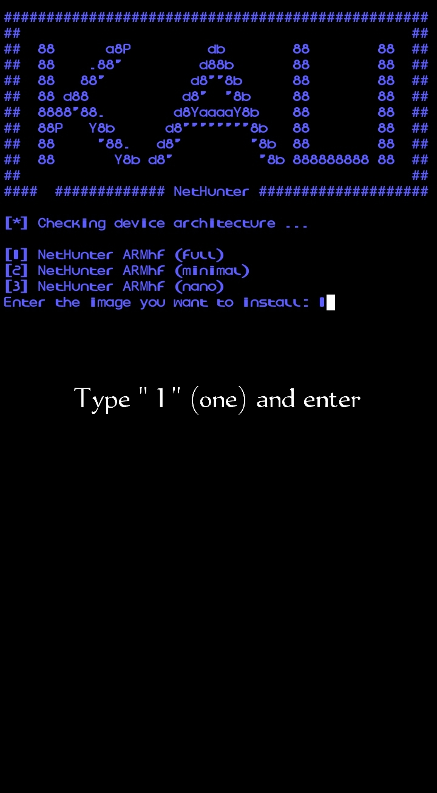

# INSTALL KALI LINUX IN ANDROID
With this repo, you can install Kali Linux net hunter in termux with vnc.

Just copy and paste the following command in termux and do what I tell you in the picture if any error occurs.

```bash
apt update && apt upgrade && apt install git && git clone https://github.com/UZAIRxDEV223/INSTALL-KALI-LINUX-IN-ANDROID-.git && cd /INSTALL-KALI-LINUX-IN-ANDROID-.git && chmod +x Installkali.sh && ./Installkali.sh
```

